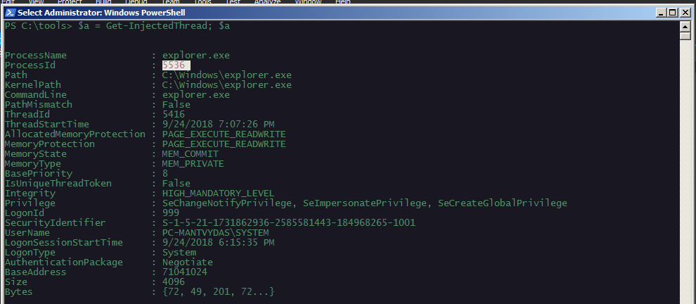
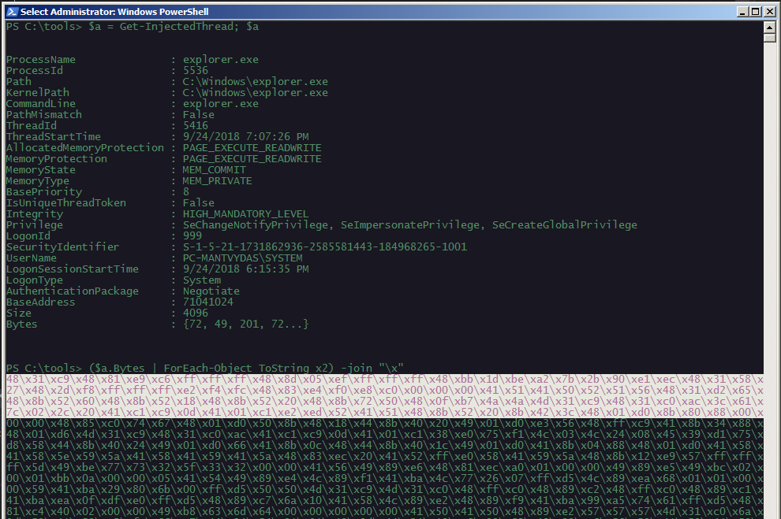
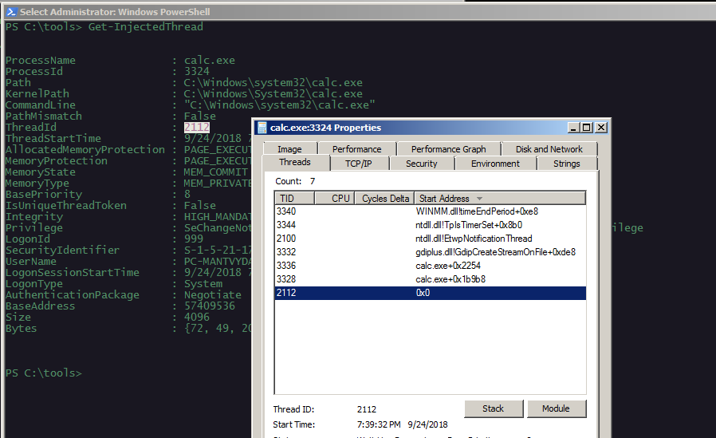
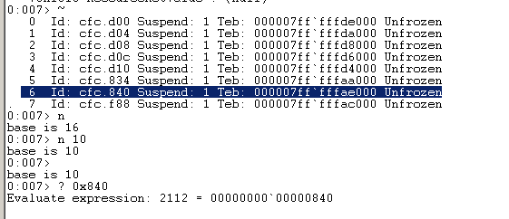
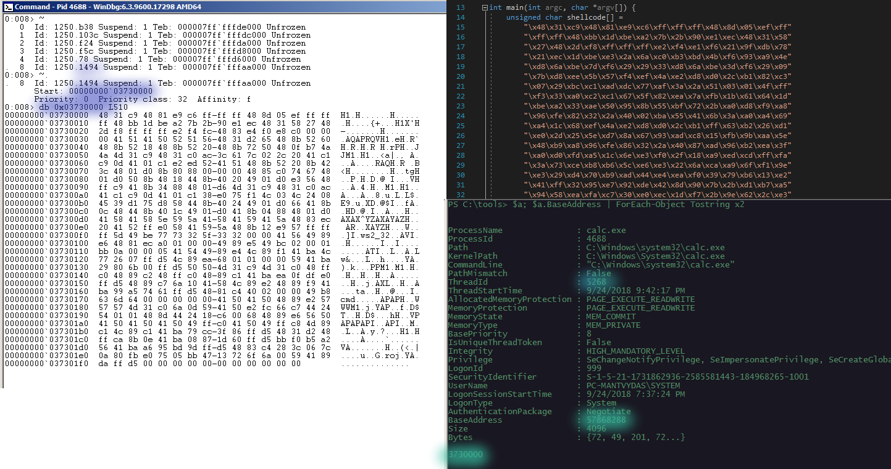
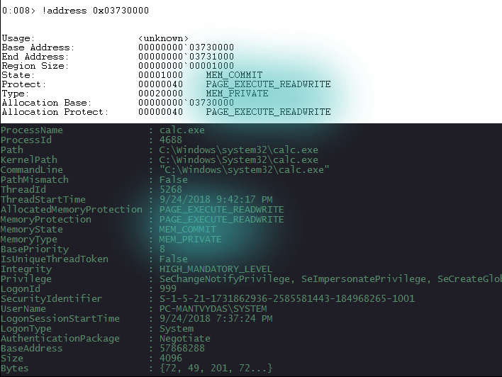

# Exploring Injected Threads

Firstly, let's use an [injector](../offensive-security-experiments/t1055-process-injection/process-injection.md) program we wrote earlier to inject some shellcode into a process that will give us a reverse shell. In this case, we are injecting the shellcode into explorer.exe:


Now that we have injected the code into a new thread of the explorer.exe process, let's scan all the running processes for any injected threads using [Get-InjectedThreads.ps1](https://gist.github.com/jaredcatkinson/23905d34537ce4b5b1818c3e6405c1d2):

```csharp
$a = Get-InjectedThread; $a
```

Looks like an injected thread was successfully detected:



Lets check the payload found in the injected thread and cross-verify with the shellcode in our injector binary:

```csharp
($a.Bytes | ForEach-Object tostring x2) -join "\x"
```



If we compare the bytes observed by `Get-InjectedThreads` with the shellcode that we used in the injector program, we see they match as expected:


In order to inspect the newly created thread in that executes the above shellcode with WinDBG, we need to know the thread id. For this experiment, we use Process Explorer and note the newly created thread's ID which is `2112`. Note the `ThreadId` is also shown in the output of Get-InjectedThread powershell script:



We can see the same in WinDBG. Note that all the threads are listed with `~` command:



Additionally, in order to inspect the bytes stored/executed in the injected thread, we need to get the thread's `StartAddress` which can be retrieved with  `~.` command when in the context of the thread of interest.

Below graphic shows the injected thread's contents with WinDBG. Note the  
Thread `0x1494 = 5268` is then inspected for its `StartAddress`, which happened to be `0x03730000 = 57868288` . 

For reference, the original shellcode bytes are displayed in the upper right corner. Bottom right corner shows the output of the `Get-InjectedThreads` indicating `ThreadId` and `StartAddress` in decimal:



One of the things Get-InjectedThreads does in order to detect code injection is - it enumerates all the threads in each running process on the system and performs the following checks on memory regions holding those threads: `MemoryType == MEM_IMAGE && MemoryState == MEM_COMMIT`. If the condition is not met, it means that the code running from the inspected thread does not have a corresponding image file on the disk, suggesting the code may have been injected directly to memory, hence the code injection.

Below graphic shows details of the memory region containing the injected thread using WinDBG and Get-InjectedThreads. Note the Type/MemoryType and State/MemoryState in WinDBG/Get-InjectedThreads outputs respectively:



{% embed data="{\"url\":\"https://posts.specterops.io/defenders-think-in-graphs-too-part-1-572524c71e91\",\"type\":\"link\",\"title\":\"Defenders Think in Graphs Too! Part 1\",\"description\":\"Introduction to Get-InjectedThread and Series Introduction\",\"icon\":{\"type\":\"icon\",\"url\":\"https://cdn-images-1.medium.com/fit/c/304/304/1\*D-FDlfkqivRBQZoESrwtqw.png\",\"width\":152,\"height\":152,\"aspectRatio\":1},\"thumbnail\":{\"type\":\"thumbnail\",\"url\":\"https://cdn-images-1.medium.com/max/834/1\*G8\_Rb1FcBsz9cWdzubDvSA.png\",\"width\":417,\"height\":721,\"aspectRatio\":1.7290167865707433}}" %}

{% embed data="{\"url\":\"https://blog.xpnsec.com/undersanding-and-evading-get-injectedthread/\",\"type\":\"link\",\"title\":\"Understanding and Evading Get-InjectedThread\",\"description\":\"One of the many areas of this field that I really enjoy is the &quot;cat and mouse&quot; game played between RedTeam and BlueTeam, each forcing the other to up their game. Often we see some awesome tools being released to help defenders detect malware or shellcode execution, and\",\"icon\":{\"type\":\"icon\",\"url\":\"https://blog.xpnsec.com/assets/favicon/android-icon-192x192.png?v=f42aa5d9f9\",\"width\":192,\"height\":192,\"aspectRatio\":1},\"thumbnail\":{\"type\":\"thumbnail\",\"url\":\"https://blog.xpnsec.com/content/images/2018/04/bypass3-1.png\",\"width\":1718,\"height\":1306,\"aspectRatio\":0.760186263096624}}" %}

{% embed data="{\"url\":\"https://docs.microsoft.com/en-us/windows/desktop/api/winnt/ns-winnt-\_memory\_basic\_information\",\"type\":\"link\",\"title\":\"\_MEMORY\_BASIC\_INFORMATION\",\"description\":\"Contains information about a range of pages in the virtual address space of a process.\",\"icon\":{\"type\":\"icon\",\"url\":\"https://docs.microsoft.com/favicon.ico\",\"aspectRatio\":0},\"thumbnail\":{\"type\":\"thumbnail\",\"url\":\"https://docs.microsoft.com/\_themes/docs.theme/master/en-us/\_themes/images/microsoft-header.png\",\"width\":128,\"height\":128,\"aspectRatio\":1}}" %}

