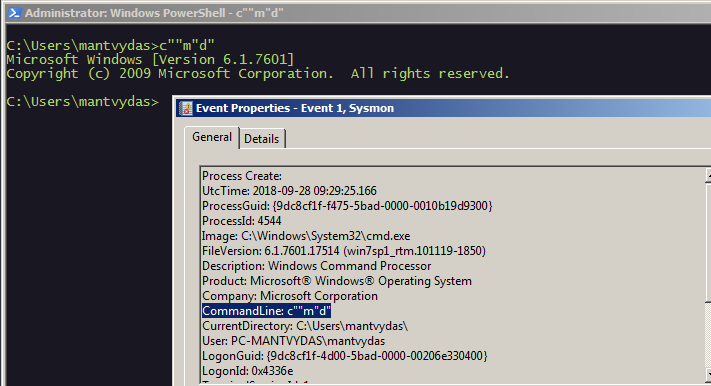
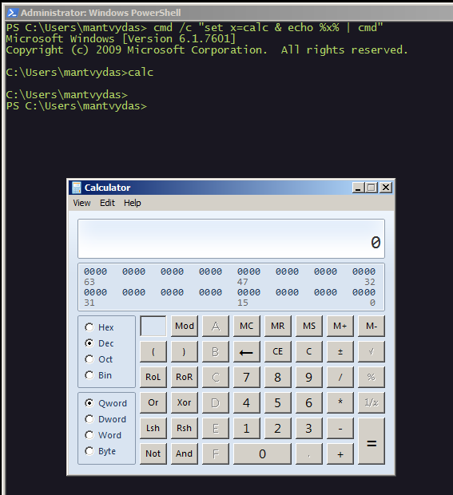
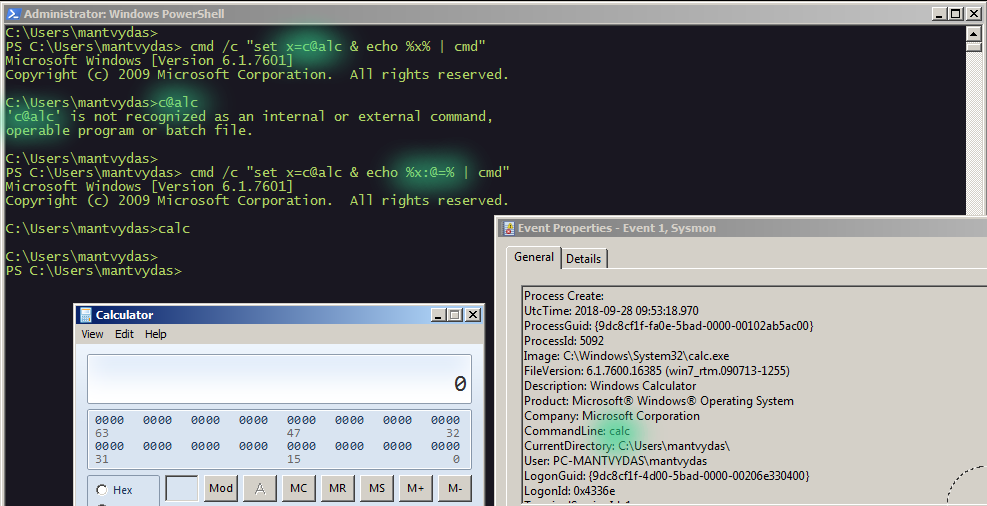

# Commandline Obfusaction

## Environment variables

```csharp
C:\Users\mantvydas>set a=/c & set b=calc
C:\Users\mantvydas>cmd %a% %b%
```

Note though that the commandline logging still works as the commandline needs to be expanded before it can get executed:


## Duoble quotes

```text
C:\Users\mantvydas>c""m"d"
```

Note how double quotes can actually make the commandline logging a bit more difficult:



## Carets

```text
C:\Users\mantvydas>n^e^t u^s^er
```

Commandline logging, same as with using environment variables, is not affected:


## Garbage delimiters

A very interesting technique. Let's look at this first without garbage delimiters:

```text
PS C:\Users\mantvydas> cmd /c "set x=calc & echo %x% | cmd"
```

The above sets en environment variable x to `calc` and then prints it and pipes it to the standard input of the cmd



Introducing garbage delimiters `@` into the equation:

```text
PS C:\Users\mantvydas> cmd /c "set x=c@alc & echo %x:@=% | cmd"
```

The above does the same as the earlier example, except that it introduces more filth into the command \(`c@lc`\). You can see from the below screenshot that Windows does not recognis such a thing as c@lc, but the `%x:@=%` removes that extraneous @ from the string and the command is then executed successfully:



If it is confusing, the below should help clear it up:

```text
PS C:\Users\mantvydas> cmd /c "set x=c@alc & echo %x:@=mantvydas% | cmd"
```


In the above, the value `mantvydas` got inserted in the c@lc in the place of @, suggesting that `%x:@=%` \(`:@=` to be precise\) is just a string replacement capability that is saying: replace the @ symbol with text that goes after the `=` sign, which is empty in this case, which effectively means - remove @ from the value stored in the variable x.

{% embed data="{\"url\":\"https://www.youtube.com/watch?v=mej5L9PE1fs\",\"type\":\"video\",\"title\":\"Invoke-DOSfuscation: Techniques FOR %F IN \(-style\) DO \(S-level CMD Obfuscation\)\",\"description\":\"Voted Best of Black Hat Asia 2018 Briefings \\nBy Daniel Bohannon\\n\\nIn this presentation, I will dive deep into cmd\[.\]exe\'s multi-faceted obfuscation opportunities beginning with carets, quotes and stdin argument hiding. Next I will extrapolate more complex techniques including FIN7\'s string removal/replacement concept and two never-before-seen obfuscation and full encoding techniques – all performed entirely in memory by cmd\[.\]exe. Finally, I will outline three approaches for obfuscating binary names from static and dynamic analysis while highlighting lesser-known cmd\[.\]exe replacement binaries.\\n\\nFull Abstract & Presentation Materials: https://www.blackhat.com/asia-18/briefings.html\#invoke-dosfuscation-techniques-for-%f-in--style-do-s-level-cmd-obfuscation\",\"icon\":{\"type\":\"icon\",\"url\":\"https://www.youtube.com/yts/img/favicon\_144-vfliLAfaB.png\",\"width\":144,\"height\":144,\"aspectRatio\":1},\"thumbnail\":{\"type\":\"thumbnail\",\"url\":\"https://i.ytimg.com/vi/mej5L9PE1fs/maxresdefault.jpg\",\"width\":1280,\"height\":720,\"aspectRatio\":0.5625},\"embed\":{\"type\":\"player\",\"url\":\"https://www.youtube.com/embed/mej5L9PE1fs?rel=0&showinfo=0\",\"html\":\"<div style=\\\"left: 0; width: 100%; height: 0; position: relative; padding-bottom: 56.2493%;\\\"><iframe src=\\\"https://www.youtube.com/embed/mej5L9PE1fs?rel=0&amp;showinfo=0\\\" style=\\\"border: 0; top: 0; left: 0; width: 100%; height: 100%; position: absolute;\\\" allowfullscreen scrolling=\\\"no\\\"></iframe></div>\",\"aspectRatio\":1.7778}}" %}

