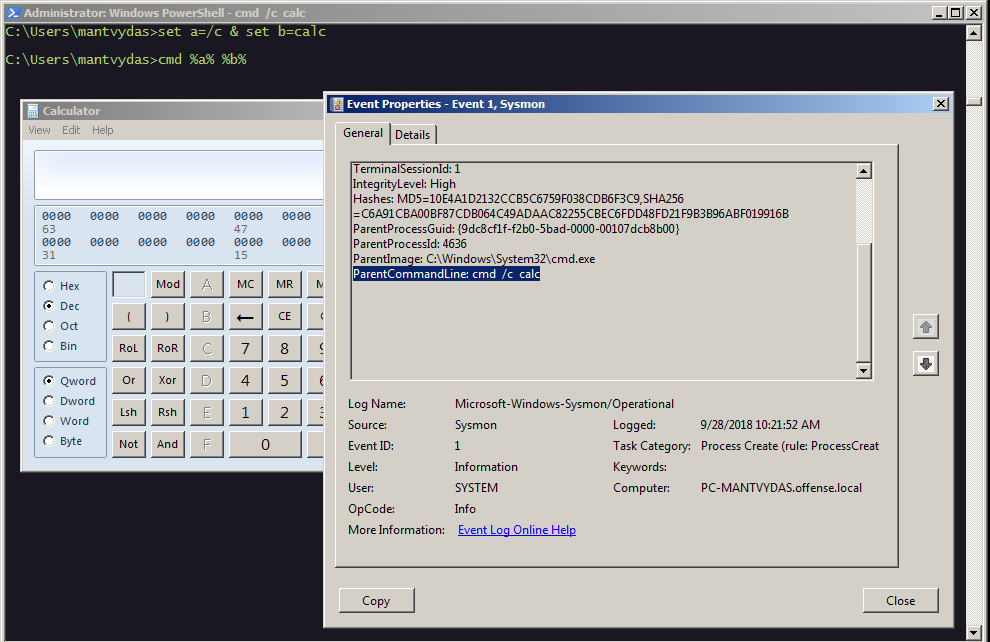
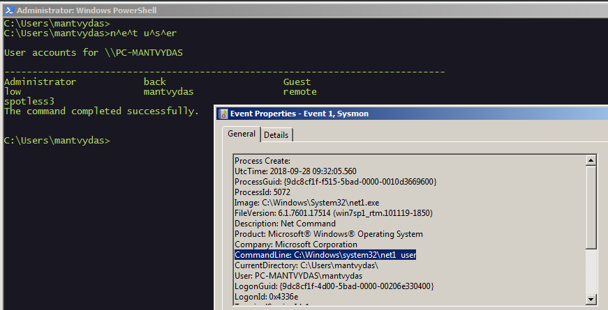
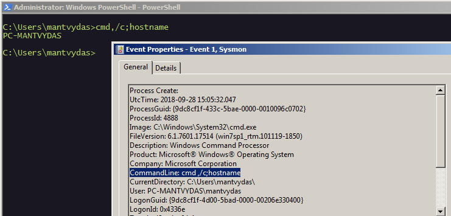
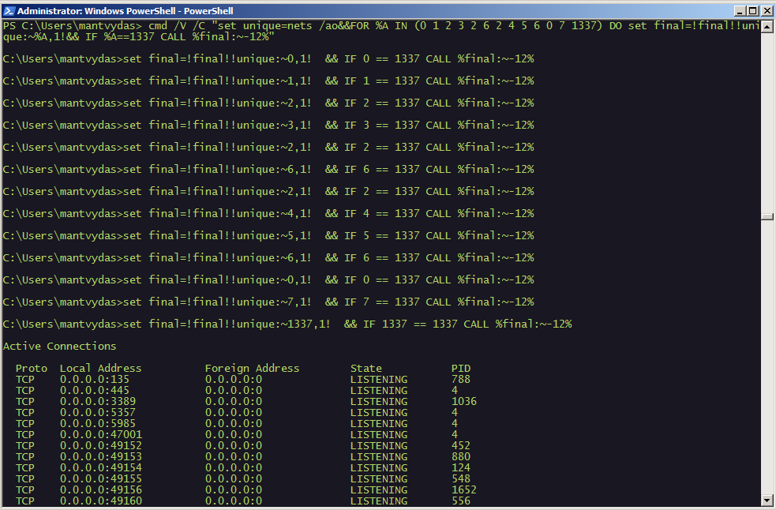

# Commandline Obfusaction

This lab is fully based on the research done by Daniel Bohannon from Fireye, see references below.

## Environment variables

```csharp
C:\Users\mantvydas>set a=/c & set b=calc
C:\Users\mantvydas>cmd %a% %b%
```

Note though that the commandline logging \(dynamic detection\) still works as the commandline needs to be expanded before it can get executed, but static detections could potentially be bypassed:



## Duoble quotes

```text
C:\Users\mantvydas>c""m"d"
```

Note how double quotes can actually make both static and dynamic detections a bit more difficult:


## Carets

```text
C:\Users\mantvydas>n^e^t u^s^er
```

Commandline logging, same as with using environment variables, is not affected, however some static detections could be bypassed:



## Garbage delimiters

A very interesting technique. Let's look at this first without garbage delimiters:

```text
PS C:\Users\mantvydas> cmd /c "set x=calc & echo %x% | cmd"
```

The above sets en environment variable x to `calc` and then prints it and pipes it to the standard input of the cmd


Introducing garbage delimiters `@` into the equation:

```text
PS C:\Users\mantvydas> cmd /c "set x=c@alc & echo %x:@=% | cmd"
```

The above does the same as the earlier example, except that it introduces more filth into the command \(`c@lc`\). You can see from the below screenshot that Windows does not recognise such `c@lc`, but later attempt when the `%x:@=%` removes that extraneous `@` symbol from the string, command is executed successfully:


If it is confusing, the below should help clear it up:

```text
PS C:\Users\mantvydas> cmd /c "set x=c@alc & echo %x:@=mantvydas% | cmd"
```


In the above, the value `mantvydas` got inserted in the c@lc in the place of @, suggesting that `%x:@=%` \(`:@=` to be precise\) is just a string replacement capability that is saying: replace the @ symbol with text that goes after the `=` sign, which is empty in this case, which effectively means - remove @ from the value stored in the variable x.

## Substring

```text
# take the first character of the value stored in %programdata% env variable

# this will take the C character from %programdata% and will launch the cmd prompt
%programdata:~0,1%md
```

Note that this is only good for bypassing static detections:


## Batch FOR, DELIMS + TOKENS

We can use a builtin batch looping to extract the Powershell string from an environment variable in order to launch it and bypass the static detections.



```text
set pSM 
PSModulePath=C:\Users\mantvydas\Documents\WindowsPowerShell\Modules;....
```



Note how the WindowsPowerShell string is present in the PSModule env variable - this mean we can extract it like so:

```text
FOR /F "tokens=7 delims=s\" %g IN ('set^|findstr PSM') do %g
```

What the above does is:

1. Executes `set^|findstr PSM` to get the PSModulePath variable value
2. splits the string using delimiters `s` & `\`
3. Prints out the 7th token, which happens to be the `PowerShell`
4. Which effectively launches PowerShell


## Comma, semicolon

This may be used for both static and dynamic detection bypasses:

```text
C:\Users\mantvydas>cmd,/c;hostname
PC-MANTVYDAS
```



## FORCoding

What happens below is essentially there is a loop that goes through the list of indexes \(0 1 2 3 2 6 2 4 5 6 0 7\) which are used to point to characters in the variable `unique`. This allows the FOR loop to concatenate the final string that gets called with `CALL %final%` when the loop reaches the index 1337.

```text
PS C:\Users\mantvydas> cmd /V /C "set unique=nets /ao&&FOR %A IN (0 1 2 3 2 6 2 4 5 6 0 7 1337) DO set final=!final!!uni
que:~%A,1!&& IF %A==1337 CALL %final:~-12%"
```



In verbose python this could look something like this:



```python
import os

dictionary = "nets -ao"
indexes = [0, 1, 2, 3, 2, 6, 2, 4, 5, 6, 0, 7, 1337]
final = ""

for index in indexes:
    if index == 1337:        
        break
    final += dictionary[index]
os.system(final)
```




{% embed data="{\"url\":\"https://www.youtube.com/watch?v=mej5L9PE1fs\",\"type\":\"video\",\"title\":\"Invoke-DOSfuscation: Techniques FOR %F IN \(-style\) DO \(S-level CMD Obfuscation\)\",\"description\":\"Voted Best of Black Hat Asia 2018 Briefings \\nBy Daniel Bohannon\\n\\nIn this presentation, I will dive deep into cmd\[.\]exe\'s multi-faceted obfuscation opportunities beginning with carets, quotes and stdin argument hiding. Next I will extrapolate more complex techniques including FIN7\'s string removal/replacement concept and two never-before-seen obfuscation and full encoding techniques – all performed entirely in memory by cmd\[.\]exe. Finally, I will outline three approaches for obfuscating binary names from static and dynamic analysis while highlighting lesser-known cmd\[.\]exe replacement binaries.\\n\\nFull Abstract & Presentation Materials: https://www.blackhat.com/asia-18/briefings.html\#invoke-dosfuscation-techniques-for-%f-in--style-do-s-level-cmd-obfuscation\",\"icon\":{\"type\":\"icon\",\"url\":\"https://www.youtube.com/yts/img/favicon\_144-vfliLAfaB.png\",\"width\":144,\"height\":144,\"aspectRatio\":1},\"thumbnail\":{\"type\":\"thumbnail\",\"url\":\"https://i.ytimg.com/vi/mej5L9PE1fs/maxresdefault.jpg\",\"width\":1280,\"height\":720,\"aspectRatio\":0.5625},\"embed\":{\"type\":\"player\",\"url\":\"https://www.youtube.com/embed/mej5L9PE1fs?rel=0&showinfo=0\",\"html\":\"<div style=\\\"left: 0; width: 100%; height: 0; position: relative; padding-bottom: 56.2493%;\\\"><iframe src=\\\"https://www.youtube.com/embed/mej5L9PE1fs?rel=0&amp;showinfo=0\\\" style=\\\"border: 0; top: 0; left: 0; width: 100%; height: 100%; position: absolute;\\\" allowfullscreen scrolling=\\\"no\\\"></iframe></div>\",\"aspectRatio\":1.7778}}" %}

{% embed data="{\"url\":\"https://www.fireeye.com/blog/threat-research/2018/03/dosfuscation-exploring-obfuscation-and-detection-techniques.html\",\"type\":\"link\",\"title\":\"DOSfuscation: Exploring the Depths of Cmd.exe Obfuscation and Detection Techniques « DOSfuscation: Exploring the Depths of Cmd.exe Obfuscation and Detection Techniques\",\"description\":\"This&nbsp;DOSfuscation white paper showcases nine months of research into several facets of command line argument obfuscation that affect static and dynamic detection approaches.&nbsp;\",\"icon\":{\"type\":\"icon\",\"url\":\"https://www.fireeye.com/content/dam/fireeye-www/brand/logos/fireeye.ico\",\"aspectRatio\":0},\"thumbnail\":{\"type\":\"thumbnail\",\"url\":\"https://www.fireeye.com/content/dam/fireeye-www/fw/images/fireeye-2-color-square.png\",\"width\":400,\"height\":400,\"aspectRatio\":1}}" %}

