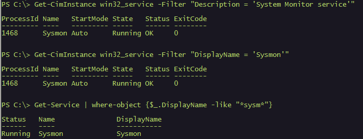
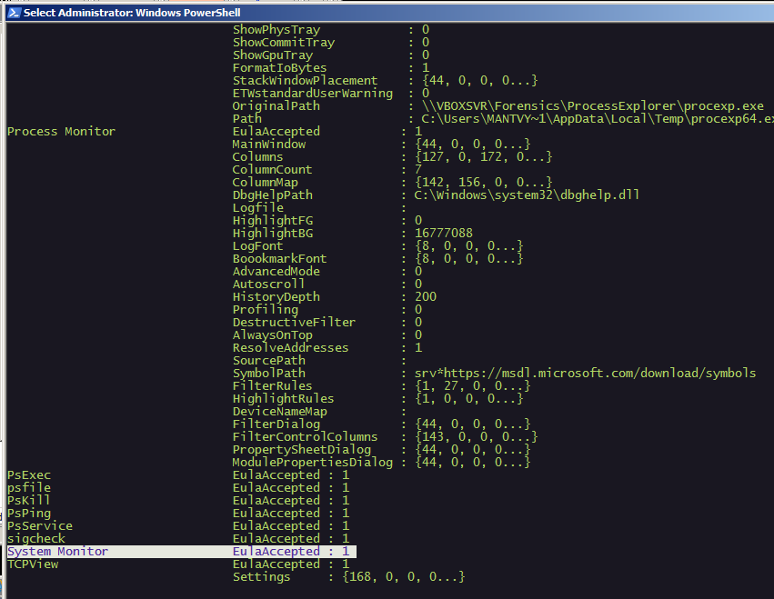

# Detecting Sysmon on the Victim Host

Once landed, on a victim machine, attackers may want to check if sysmon is installed on the system.

## Processes



```csharp
PS C:\> Get-Process | Where-Object { $_.ProcessName -eq "Sysmon" }
```





Note: process name can be changed during installation


## Services

```csharp
Get-CimInstance win32_service -Filter "Description = 'System Monitor service'"
# or
Get-Service | where-object {$_.DisplayName -like "*sysm*"}
```




Note: display names and descriptions can be changed


## Windows Events

```csharp
reg query HKLM\SOFTWARE\Microsoft\Windows\CurrentVersion\WINEVT\Channels\Microsoft-Windows-Sysmon/Operational
```


## Filters

```text
PS C:\> fltMC.exe
```

Note how even though you can change the service name and the driver name, the sysmon altitude is always the same - `385201`


## Sysmon Tools + Accepted Eula

```text
ls HKCU:\Software\Sysinternals
```



## Bypass?

Take a look at ways to bypass the sysmon:






