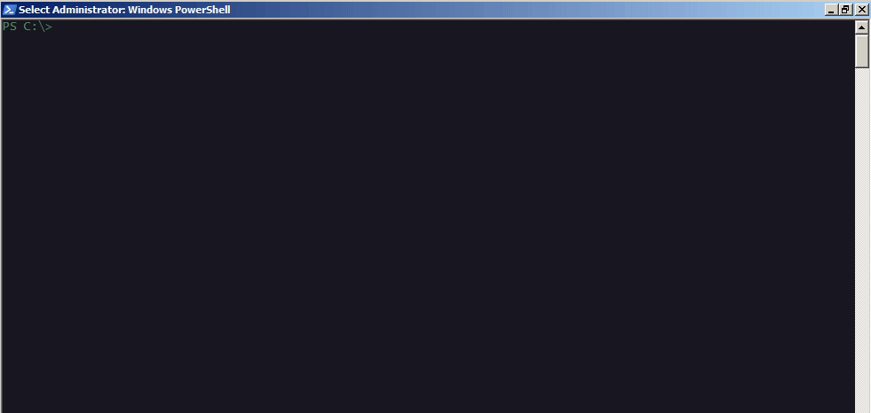
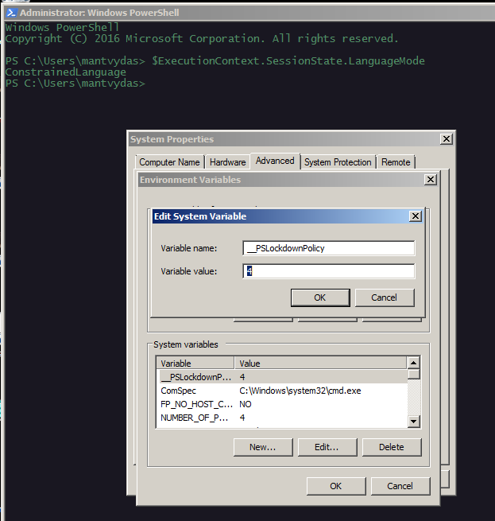
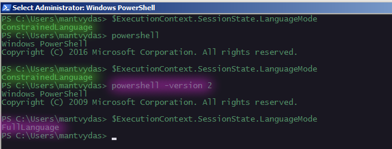

# Powershell without Powershell \(?\)

Constrained Language Mode in short locks down the nice features of Powershell usually required for complex attacks to be carried out.

## Powershell Inside Powershell

For fun - creating another powershell instance inside powershell without actually spawning a new `powershell.exe` process:



## Constrained Language Mode

Enabling constrained language mode, that does not allow powershell execute complex attacks \(i.e. mimikatz\):

```csharp
[Environment]::SetEnvironmentVariable(‘__PSLockdownPolicy‘, ‘4’, ‘Machine‘)
```

Checking constrained language mode is enabled:

```csharp
PS C:\Users\mantvydas> $ExecutionContext.SessionState.LanguageMode
ConstrainedLanguage
```



With `ConstrainedLanguage`, trying to download a file from remote machine, we get `Access Denied`:


However, if you have access to the system and enough privileges to change environment variables, the lock can be lifted by removing the variable `__PSLockdownPolicy` and re-spawning another powershell instance.

### Powershell Downgrade

If you have the ability to downgrade to Powershell 2.0, this can allow you to bypass the `ConstrainedLanguage`mode. Note how `$ExecutionContext.SessionState.LanguageMode` keeps returning `ConstrainedLangue` in powershell instances that were not launched with `-version Powershell 2` until it does not:





{% embed data="{\"url\":\"https://www.blackhillsinfosec.com/powershell-without-powershell-how-to-bypass-application-whitelisting-environment-restrictions-av/\",\"type\":\"link\",\"title\":\"Powershell Without Powershell - How To Bypass Application Whitelisting, Environment Restrictions & AV - Black Hills Information Security\",\"description\":\"Brian Fehrman \(With shout outs to: Kelsey Bellew, Beau Bullock\) // In a previous blog post, we talked about bypassing AV and Application Whitelisting by using a method developed by Casey Smith. In a recent engagement, we ran into an environment with even more restrictions in place. Not only did they have AV and Application Whitelisting, they were …\",\"icon\":{\"type\":\"icon\",\"url\":\"https://www.blackhillsinfosec.com/apple-touch-icon.png\",\"width\":180,\"height\":180,\"aspectRatio\":1},\"thumbnail\":{\"type\":\"thumbnail\",\"url\":\"https://www.blackhillsinfosec.com/wp-content/uploads/2016/11/header-1024x379.png\",\"width\":1024,\"height\":379,\"aspectRatio\":0.3701171875}}" %}



