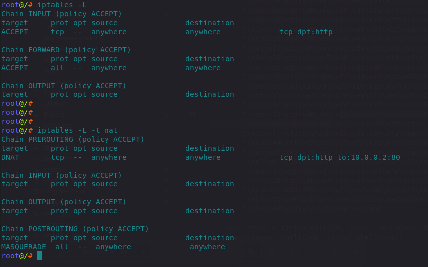
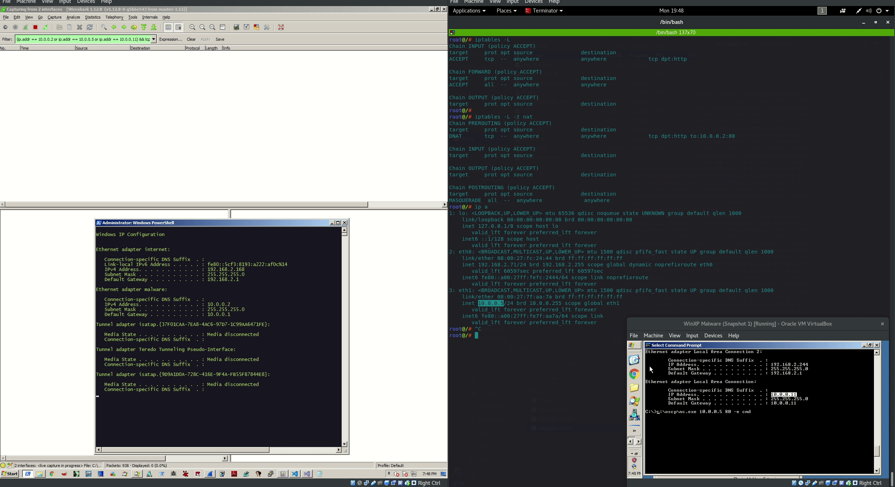
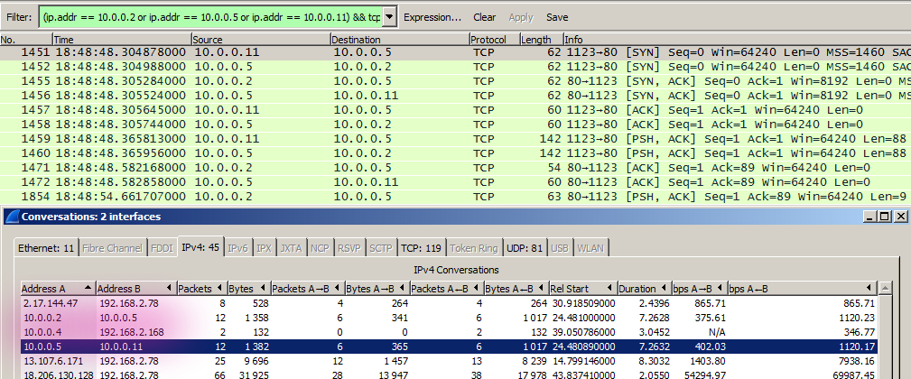
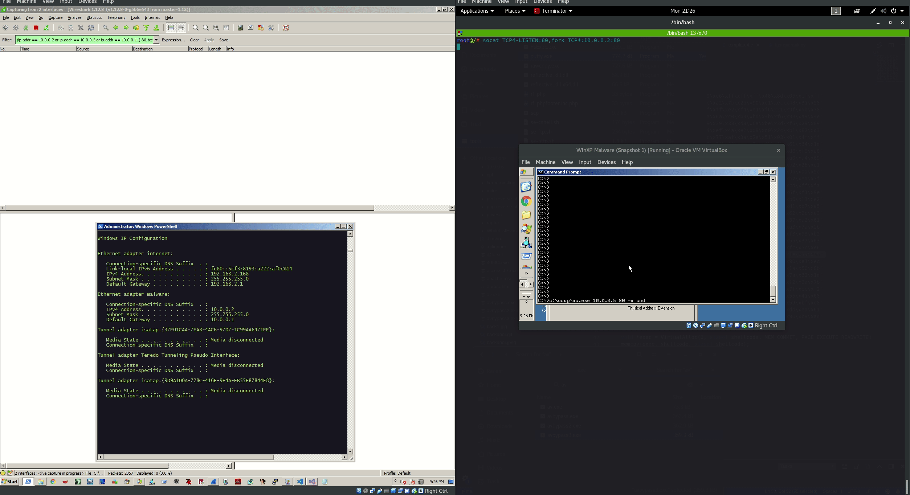

# Redirectors / Forwarders

## Purpose

Re-directors or traffic forwarders are essentially proxies between the red teaming server \(say the one for sending phishing emails or a C2 server\) and the victim: `victim <> re-director <> team server`

The purpose of the re-director host is as usual:

* Obscure the red-teaming server by concealing its IP address. In other words - the victim will see traffic coming from the re-director host rather than the team server.
* If incident responders detect suspicious activity originating from the redirector, it can be "easily" decommissioned and replaced with another one, which is "easier" than rebuilding the team server.

## HTTP Forwarding with iptables

I will explore simple HTTP forwarders which are just that - they simply listen on a given interface and port and forward all the traffic they receive on that port, to a listener port on the team server.

Environment in this example:

* Attacker host and a listening port: `10.0.0.2:80`
* Re-director host and a listening port: `10.0.0.5:80`
* Victim host: `10.0.0.11`

An easy way to create an HTTP re-director is to use a Linux box and its iptables capability. Below shows how to turn a Linux box into an HTTP re-director. In this case, all the HTTP traffic to `10.0.0.5:80` will be forwarded to `10.0.0.2:80` :

```text
iptables -I INPUT -p tcp -m tcp --dport 80 -j ACCEPT
iptables -t nat -A PREROUTING -p tcp --dport 80 -j DNAT --to-destination 10.0.0.2:80
iptables -t nat -A POSTROUTING -j MASQUERADE
iptables -I FORWARD -j ACCEPT
iptables -P FORWARD ACCEPT
sysctl net.ipv4.ip_forward=1
```

Checking that the iptables rules were created successfully:



Let's simulate a simplified reverse shell from a victim system 10.0.0.11 to the attacking system 10.0.0.2 using redirector system 10.0.0.5 as a proxy and inspect the traffic over the wire - if redirectos was setup correctly, systems 10.0.0.11 and 10.0.0.2 should not be communicating directly - all the traffic will be flowing through 10.0.0.5 and 10.0.0.2 \(attacking system\) will not be visible to the victim 10.0.0.11:



Having a closer look at the traffic/conversations between the endpoints, we can clearly see that at no point the victim system 10.0.0.11 communicated directly with the attacking system 10.0.0.2 - all communications were flowing through the redirector host 10.0.0.5:





## HTTP Forwarding with SOCAT

SOCAT is another tools that can be used to do the "dumb pipe" \(simple\) traffic forwarding. The environment remains the same as described in the above lab.

Setting up an HTTP redirector with socat:

```text
socat TCP4-LISTEN:80,fork TCP4:10.0.0.2:80
```



{% embed data="{\"url\":\"https://github.com/bluscreenofjeff/Red-Team-Infrastructure-Wiki\#https\",\"type\":\"link\",\"title\":\"bluscreenofjeff/Red-Team-Infrastructure-Wiki\",\"description\":\"Wiki to collect Red Team infrastructure hardening resources - bluscreenofjeff/Red-Team-Infrastructure-Wiki\",\"icon\":{\"type\":\"icon\",\"url\":\"https://github.com/fluidicon.png\",\"aspectRatio\":0},\"thumbnail\":{\"type\":\"thumbnail\",\"url\":\"https://avatars1.githubusercontent.com/u/6732151?s=400&v=4\",\"width\":400,\"height\":400,\"aspectRatio\":1}}" %}







[https://www.thegeekstuff.com/2011/01/iptables-fundamentals/](https://www.thegeekstuff.com/2011/01/iptables-fundamentals/)

